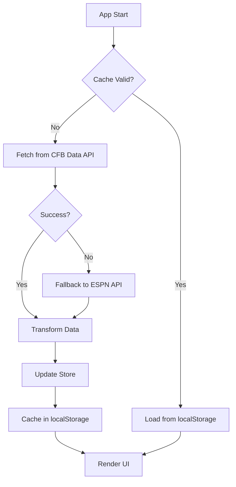
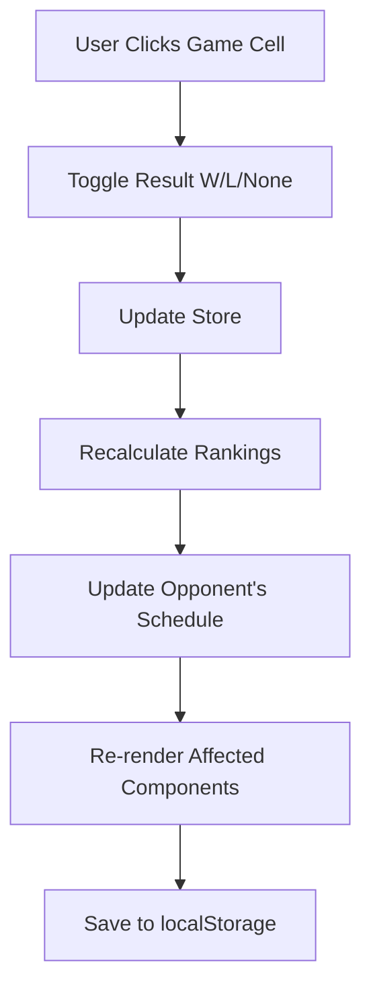

# College Football Schedule Matrix - Redesign Document

## Executive Summary

Remake the current vanilla JS app into a modern, mobile-optimized React application with better performance, maintainability, and user experience. Deploy as a static site (GitHub Pages or similar) with no backend required.

---

## Current State Analysis

### What Works Well
- ✅ **Single-page application** - Fast, no page reloads
- ✅ **GitHub Pages hosting** - Free, simple, reliable
- ✅ **Interactive features** - Win/loss toggling, drag-and-drop
- ✅ **Rankings system** - Dynamic calculations based on results
- ✅ **No backend needed** - All client-side logic

### Pain Points
- ❌ **Large single HTML file** (3,496 lines) - Hard to maintain
- ❌ **No component structure** - Code duplication
- ❌ **Manual DOM manipulation** - Error-prone, verbose
- ❌ **Not mobile-optimized** - Small touch targets, overflow issues
- ❌ **No state management** - Data scattered across DOM
- ❌ **Limited API usage** - Only using ESPN API

---

## Technology Stack

### Frontend Framework: **React + TypeScript**

**Why React?**
- ✅ Component-based architecture (easier to maintain)
- ✅ Virtual DOM (better performance for frequent updates)
- ✅ Huge ecosystem (UI libraries, drag-and-drop, etc.)
- ✅ Easy to optimize for mobile (responsive hooks)
- ✅ Can still deploy as static site (GitHub Pages compatible)

**Why TypeScript?**
- ✅ Type safety for complex data structures (games, teams, rankings)
- ✅ Better IDE support and autocomplete
- ✅ Catch bugs at compile time, not runtime
- ✅ Self-documenting code

### Build Tool: **Vite**

**Why Vite?**
- ⚡ Lightning-fast dev server and builds
- 📦 Optimized production bundles
- 🔄 Hot Module Replacement (HMR)
- 🎯 Built for modern React apps
- 📱 Easy to configure for mobile optimization

### State Management: **Zustand or React Context**

**Zustand** (Recommended)
- Simple, minimal boilerplate
- Perfect for this use case (no server sync needed)
- Easy to persist state to localStorage
- TypeScript-friendly

```typescript
// Example store
interface ScheduleStore {
  scheduleData: ScheduleData;
  selectedDivision: 'FBS' | 'FCS';
  rankings: Rankings;
  toggleGameResult: (teamName: string, week: number) => void;
  updateRankings: () => void;
}
```

### UI Framework: **Tailwind CSS + Radix UI / shadcn/ui**

**Tailwind CSS**
- 🎨 Utility-first CSS (fast prototyping)
- 📱 Mobile-first responsive design
- 🔧 Easy to customize
- 📦 Tree-shaking (only ship CSS you use)

**Radix UI / shadcn/ui**
- ♿ Accessible components out of the box
- 🎯 Unstyled primitives (full control)
- 📱 Mobile-friendly touch targets
- 🔽 Collapsible, Accordion, Dialog built-in

### Drag & Drop: **dnd-kit**

**Why dnd-kit?**
- 📱 Touch-friendly (works on iPad/iPhone)
- ⚡ Performant (uses modern browser APIs)
- ♿ Accessible
- 🎨 Highly customizable
- 📦 Small bundle size

---

## API Strategy

### Primary API: **CollegeFootballData.com**

**Endpoints to Use:**
```
GET /games?year=2025&seasonType=regular
GET /teams/fbs?year=2025
GET /teams/fcs?year=2025
GET /rankings?year=2025&week={week}&seasonType=regular
GET /games/teams?year=2025&team={team}
```

**Benefits:**
- 🏈 More comprehensive data than ESPN
- 📊 Built-in rankings data
- 🔄 Historical data available
- 🆓 Free tier available (API key required)
- 📚 Well-documented

**API Key Management:**
```typescript
// Use environment variables
const API_KEY = import.meta.env.VITE_CFB_API_KEY;

// Store in .env.local (not committed)
VITE_CFB_API_KEY=your_key_here

// For production, use GitHub Secrets
```

### Fallback API: **ESPN API**

Keep ESPN API as fallback for:
- Logo URLs (higher quality)
- Real-time scores during games
- Missing data edge cases

### Data Caching Strategy

```typescript
// Cache in localStorage with expiration
interface CachedData {
  data: ScheduleData;
  timestamp: number;
  version: string;
}

// Refresh every 24 hours or on user request
const CACHE_DURATION = 24 * 60 * 60 * 1000;
```

---

## Application Architecture

### File Structure

```
college-football-matrix/
├── public/
│   ├── favicon.ico
│   └── assets/
├── src/
│   ├── components/
│   │   ├── ui/           # shadcn/ui components
│   │   ├── schedule/
│   │   │   ├── ScheduleMatrix.tsx
│   │   │   ├── GameCell.tsx
│   │   │   ├── TeamHeader.tsx
│   │   │   ├── WeekHeader.tsx
│   │   │   └── ConferenceSection.tsx
│   │   ├── rankings/
│   │   │   ├── RankingsTable.tsx
│   │   │   ├── RankingCell.tsx
│   │   │   └── RankingCalculator.ts
│   │   ├── layout/
│   │   │   ├── Header.tsx
│   │   │   ├── DivisionSelector.tsx
│   │   │   └── VersionInfo.tsx
│   │   └── mobile/
│   │       ├── MobileSchedule.tsx
│   │       ├── TouchOptimized.tsx
│   │       └── SwipeGestures.tsx
│   ├── hooks/
│   │   ├── useScheduleData.ts
│   │   ├── useRankings.ts
│   │   ├── useDragDrop.ts
│   │   └── useResponsive.ts
│   ├── store/
│   │   ├── scheduleStore.ts
│   │   ├── rankingsStore.ts
│   │   └── uiStore.ts
│   ├── services/
│   │   ├── cfbDataApi.ts
│   │   ├── espnApi.ts
│   │   ├── dataCache.ts
│   │   └── dataTransform.ts
│   ├── types/
│   │   ├── schedule.ts
│   │   ├── team.ts
│   │   ├── game.ts
│   │   └── rankings.ts
│   ├── utils/
│   │   ├── rankingCalculator.ts
│   │   ├── dateFormatter.ts
│   │   └── teamAbbreviations.ts
│   ├── App.tsx
│   ├── main.tsx
│   └── index.css
├── .env.local            # API keys (gitignored)
├── .env.example          # Template for API keys
├── vite.config.ts
├── tailwind.config.ts
├── tsconfig.json
├── package.json
└── README.md
```

### Component Hierarchy

```
App
├── Header
│   ├── Title
│   └── VersionInfo
├── DivisionSelector (FBS/FCS tabs)
└── ScheduleContainer
    ├── RankingsSection (collapsible)
    │   └── RankingsTable
    │       └── RankingCell[]
    └── ConferencesSection
        └── ConferenceSection[] (collapsible)
            ├── ConferenceHeader
            ├── WeekHeaders
            └── TeamRows[]
                ├── TeamHeader (draggable)
                └── GameCell[] (clickable, droppable)
```

---

## Mobile Optimization

### Responsive Breakpoints

```typescript
const breakpoints = {
  mobile: '640px',   // iPhone, small Android
  tablet: '768px',   // iPad mini, portrait
  desktop: '1024px', // iPad Pro, desktop
  wide: '1280px'     // Large desktop
};
```

### Mobile-Specific Features

**1. Touch-Optimized Interactions**
```typescript
// Larger touch targets
const MIN_TOUCH_TARGET = 44; // 44px iOS guideline

// Gesture support
- Swipe left/right: Navigate weeks
- Long press: Edit mode
- Pinch: Zoom in/out (for large grids)
```

**2. Adaptive Layout**
```typescript
// Mobile: Vertical scrolling, one team at a time
// Tablet: Horizontal scrolling, grid view
// Desktop: Full grid, all visible

if (isMobile) {
  return <MobileScheduleView />;
} else if (isTablet) {
  return <TabletScheduleView />;
} else {
  return <DesktopScheduleView />;
}
```

**3. Performance Optimizations**
```typescript
// Virtual scrolling for large lists
import { useVirtualizer } from '@tanstack/react-virtual';

// Lazy loading for images


// Code splitting
const RankingsSection = lazy(() => import('./RankingsSection'));
```

**4. PWA Support (Optional)**
```typescript
// Add to homescreen capability
// Offline support with service worker
// Push notifications for game updates
```

---

## Hosting Options

### Option 1: **GitHub Pages** (Recommended)

**Pros:**
- ✅ Free
- ✅ Custom domain support
- ✅ HTTPS by default
- ✅ Perfect for static React apps
- ✅ Automatic deploys via GitHub Actions

**Setup:**
```yaml
# .github/workflows/deploy.yml
name: Deploy to GitHub Pages

on:
  push:
    branches: [main]

jobs:
  deploy:
    runs-on: ubuntu-latest
    steps:
      - uses: actions/checkout@v3
      - uses: actions/setup-node@v3
      - run: npm install
      - run: npm run build
      - uses: peaceiris/actions-gh-pages@v3
        with:
          github_token: ${{ secrets.GITHUB_TOKEN }}
          publish_dir: ./dist
```

**Cons:**
- ❌ Public repos only (unless GitHub Pro)
- ❌ No server-side logic

### Option 2: **Vercel**

**Pros:**
- ✅ Free tier
- ✅ Automatic deploys from GitHub
- ✅ Edge caching (faster worldwide)
- ✅ Preview deployments for PRs
- ✅ Built for React apps

**Cons:**
- ❌ Bandwidth limits on free tier

### Option 3: **Netlify**

**Pros:**
- ✅ Free tier
- ✅ Form handling (if needed later)
- ✅ Edge functions (serverless)
- ✅ Split testing

**Cons:**
- ❌ Build minute limits

### Option 4: **Cloudflare Pages**

**Pros:**
- ✅ Free, unlimited bandwidth
- ✅ Global CDN
- ✅ Fast builds
- ✅ Workers (serverless) available

**Recommendation:**
Start with **GitHub Pages** (simplest), migrate to **Vercel** if you need better performance or analytics.

---

## Data Flow Architecture

### Data Loading Flow



### User Interaction Flow



---

## Key Features & Implementation

### 1. Interactive Schedule Matrix

**Component: `GameCell.tsx`**
```typescript
interface GameCellProps {
  game: Game;
  team: Team;
  week: number;
  onToggleResult: (result: 'W' | 'L' | null) => void;
  isDraggable: boolean;
}

const GameCell = ({ game, team, week, onToggleResult, isDraggable }: GameCellProps) => {
  const [result, setResult] = useState(game.result);
  
  const handleClick = () => {
    if (game.isPlayed) return; // Can't change historical results
    
    const nextResult = result === null ? 'W' : 
                      result === 'W' ? 'L' : null;
    setResult(nextResult);
    onToggleResult(nextResult);
  };
  
  return (
    <div
      onClick={handleClick}
      className={cn(
        "cell",
        result === 'W' && "bg-green-100",
        result === 'L' && "bg-red-100",
        "hover:scale-105 transition-transform",
        "cursor-pointer",
        "min-h-[44px]" // Mobile touch target
      )}
    >
      {/* Cell content */}
    </div>
  );
};
```

### 2. Drag & Drop for Team Swapping

**Hook: `useDragDrop.ts`**
```typescript
import { useDndContext, DragEndEvent } from '@dnd-kit/core';

const useDragDrop = () => {
  const handleDragEnd = (event: DragEndEvent) => {
    const { active, over } = event;
    
    if (!over) return;
    
    // Swap teams in schedule
    swapTeams(active.id, over.id);
    
    // Update both teams' schedules
    updateSchedules();
    
    // Recalculate rankings
    recalculateRankings();
  };
  
  return { handleDragEnd };
};
```

### 3. Dynamic Rankings Calculation

**Utility: `rankingCalculator.ts`**
```typescript
interface RankingWeights {
  homeWin: number;
  awayWin: number;
  homeLoss: number;
  awayLoss: number;
}

const calculateRankings = (
  teams: Team[],
  games: Game[],
  week: number,
  weights: RankingWeights = {
    homeWin: 1.0,
    awayWin: 1.3,  // Away wins worth more
    homeLoss: -1.0,
    awayLoss: -0.8  // Away losses less punishing
  }
): Ranking[] => {
  return teams.map(team => {
    const teamGames = games.filter(g => 
      g.homeTeam === team.id || g.awayTeam === team.id
    ).slice(0, week);
    
    let score = 0;
    let wins = 0;
    let losses = 0;
    
    teamGames.forEach(game => {
      const isHome = game.homeTeam === team.id;
      const won = (isHome && game.homeScore > game.awayScore) ||
                  (!isHome && game.awayScore > game.homeScore);
      
      if (won) {
        score += isHome ? weights.homeWin : weights.awayWin;
        wins++;
      } else {
        score += isHome ? weights.homeLoss : weights.awayLoss;
        losses++;
      }
    });
    
    return {
      team,
      rank: 0, // Assigned after sorting
      score,
      record: `${wins}-${losses}`,
      change: 0 // Calculated vs previous week
    };
  }).sort((a, b) => b.score - a.score)
    .map((ranking, index) => ({
      ...ranking,
      rank: index + 1
    }));
};
```

### 4. Responsive Mobile View

**Component: `MobileScheduleView.tsx`**
```typescript
const MobileScheduleView = () => {
  return (
    <div className="mobile-schedule">
      {/* Swipeable week navigation */}
      <WeekCarousel />
      
      {/* Accordion for teams */}
      <Accordion type="single" collapsible>
        {teams.map(team => (
          <AccordionItem value={team.id} key={team.id}>
            <AccordionTrigger>
              <TeamHeader team={team} />
            </AccordionTrigger>
            <AccordionContent>
              <TeamSchedule team={team} />
            </AccordionContent>
          </AccordionItem>
        ))}
      </Accordion>
    </div>
  );
};
```

---

## Development Phases

### Phase 1: Setup & Foundation (Week 1)
- [ ] Initialize Vite + React + TypeScript project
- [ ] Set up Tailwind CSS + shadcn/ui
- [ ] Configure GitHub Pages deployment
- [ ] Set up environment variables for API keys
- [ ] Create basic TypeScript types

### Phase 2: Data Layer (Week 1-2)
- [ ] Implement CFB Data API service
- [ ] Implement ESPN API fallback
- [ ] Create data transformation layer
- [ ] Set up Zustand store
- [ ] Implement localStorage caching
- [ ] Test API integration

### Phase 3: Core Components (Week 2-3)
- [ ] Build ScheduleMatrix component
- [ ] Build GameCell component
- [ ] Build TeamHeader component
- [ ] Build ConferenceSection component
- [ ] Implement collapsible sections
- [ ] Style with Tailwind

### Phase 4: Interactive Features (Week 3-4)
- [ ] Implement click-to-toggle results
- [ ] Add dnd-kit for drag & drop
- [ ] Implement team swapping
- [ ] Build rankings calculator
- [ ] Auto-update rankings on changes
- [ ] Add loading states & error handling

### Phase 5: Mobile Optimization (Week 4)
- [ ] Create responsive breakpoints
- [ ] Build mobile-specific layouts
- [ ] Optimize touch targets
- [ ] Add gesture support
- [ ] Test on real devices (iPhone, iPad)
- [ ] Performance optimization

### Phase 6: Polish & Deploy (Week 5)
- [ ] Add version info automation
- [ ] Implement dark mode (optional)
- [ ] Add keyboard navigation
- [ ] Accessibility audit
- [ ] Performance testing
- [ ] Deploy to GitHub Pages
- [ ] Documentation

---

## Performance Targets

### Load Time
- ⚡ First Contentful Paint: < 1.5s
- ⚡ Time to Interactive: < 3s
- ⚡ Total Page Size: < 500KB (gzipped)

### Runtime Performance
- 🎯 60fps animations
- 🎯 < 100ms interaction response
- 🎯 Smooth scrolling on mobile

### Optimization Techniques
```typescript
// 1. Code splitting
const Rankings = lazy(() => import('./Rankings'));

// 2. Image optimization


// 3. Memoization
const MemoizedGameCell = memo(GameCell, (prev, next) => 
  prev.game.id === next.game.id && 
  prev.game.result === next.game.result
);

// 4. Virtual scrolling for large lists
const virtualizer = useVirtualizer({
  count: teams.length,
  getScrollElement: () => containerRef.current,
  estimateSize: () => 50,
});
```

---

## API Key Management

### Development
```bash
# .env.local (gitignored)
VITE_CFB_DATA_API_KEY=your_key_here
VITE_ESPN_API_KEY=if_needed
```

### Production (GitHub Pages)

**Option A: Environment Variables in Build**
```yaml
# GitHub Actions workflow
env:
  VITE_CFB_DATA_API_KEY: ${{ secrets.CFB_API_KEY }}
```

**Option B: Client-side Key (Less Secure)**
```typescript
// If API allows CORS, embed key in build
// Use domain restrictions on API key
const API_KEY = import.meta.env.VITE_CFB_DATA_API_KEY;
```

**Option C: Proxy Service (Most Secure)**
```typescript
// Use Cloudflare Worker or Vercel Edge Function
// to proxy API requests and hide key
fetch('/api/games') // Proxies to CFB Data API
```

---

## Migration Strategy

### From Current App to New App

**Data Migration:**
1. Export current localStorage data (if any)
2. Transform to new schema
3. Import into new app

**Feature Parity Checklist:**
- [ ] All teams display correctly
- [ ] Conference grouping works
- [ ] Win/loss toggling
- [ ] Drag & drop team swapping
- [ ] Rankings calculation
- [ ] Collapsible sections
- [ ] Version tracking

**Parallel Deployment:**
1. Deploy new app to: `yourusername.github.io/cfb-matrix-v2/`
2. Test thoroughly
3. Update main repo when ready
4. Redirect old URL to new app

---

## Success Metrics

### User Experience
- ✅ Works on iPhone, iPad, Desktop
- ✅ < 3 second load time
- ✅ No layout shifts
- ✅ Smooth 60fps interactions
- ✅ Accessible (WCAG 2.1 AA)

### Developer Experience
- ✅ Easy to add new features
- ✅ Type-safe code
- ✅ Fast development iteration
- ✅ Clear component boundaries
- ✅ Good test coverage (optional)

### Maintenance
- ✅ Auto-deployment on push
- ✅ Version tracking
- ✅ Error monitoring (optional: Sentry)
- ✅ Analytics (optional: Plausible/Umami)

---

## Cost Analysis

### Free Tier Options (Recommended)
- **GitHub Pages**: $0
- **CFB Data API**: $0 (free tier)
- **ESPN API**: $0 (public)
- **Domain**: $10-15/year (optional)
- **Total**: **$0-15/year**

### Paid Options (If Scaling)
- **Vercel Pro**: $20/month
- **CFB Data API Pro**: $20/month
- **Sentry (errors)**: $26/month
- **Total**: ~$66/month (overkill for this use case)

**Recommendation:** Stick with free tier until you hit limits.

---

## Future Enhancements

### Phase 2 Features (After Launch)
1. **Historical Data**
   - View past seasons (2024, 2023, etc.)
   - Compare rankings year-over-year

2. **Sharing & Collaboration**
   - Share predicted rankings (URL params)
   - Export schedule as PNG/PDF

3. **Analytics Dashboard**
   - Conference strength ratings
   - Strength of schedule calculator
   - Win probability predictions

4. **User Accounts (Optional)**
   - Save multiple prediction scenarios
   - Compare with friends
   - Requires backend (Firebase, Supabase)

5. **Real-Time Updates**
   - Live scores during game days
   - Push notifications (PWA)
   - WebSocket connection

6. **AI Predictions**
   - ML model for win probability
   - Suggest likely outcomes
   - Compare with Vegas lines

---

## Conclusion

### Recommended Approach

1. **Start Simple**: React + Vite + TypeScript + Tailwind
2. **Host on GitHub Pages**: Free, reliable
3. **Use CFB Data API**: Better data than ESPN
4. **Mobile-First Design**: Works on all devices
5. **Iterate Quickly**: Ship v1 in 2-3 weeks

### Why This Is Better Than Current App

| Feature | Current | New |
|---------|---------|-----|
| **Maintainability** | Single 3.5k line file | Modular components |
| **Performance** | Manual DOM | Optimized React |
| **Mobile** | Desktop-only | Fully responsive |
| **Type Safety** | None | Full TypeScript |
| **API Data** | Limited ESPN | Comprehensive CFB Data |
| **Deployment** | Manual | Automated CI/CD |
| **Developer Experience** | Difficult | Modern tooling |

### Next Steps

1. Review this document
2. Get CFB Data API key
3. Set up new repo: `college-football-matrix-v2`
4. Start with Phase 1 (setup)
5. Ship MVP in 3 weeks

---

**Questions?** Let me know what to clarify or expand on!

